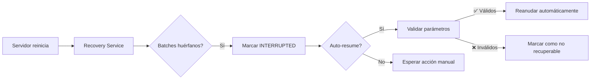
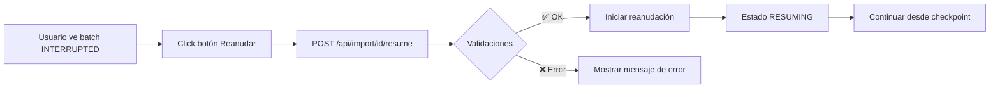
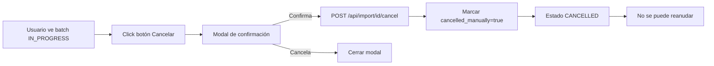

# Sistema de Recuperación y Control de Importaciones

## 📋 Descripción

Sistema completo para recuperar importaciones interrumpidas y permitir control manual (reanudar/cancelar) desde la interfaz de usuario.

## ✨ Características Implementadas

### 1. Reanudación Automática

**Al reiniciar el servidor:**

- ✅ Detecta automáticamente importaciones interrumpidas
- ✅ Las marca como `INTERRUPTED`
- ✅ Intenta reanudarlas automáticamente si está configurado
- ✅ Continúa desde el último checkpoint guardado

**Configuración (.env.local):**

```env
IMPORT_RECOVERY_ENABLED=true
IMPORT_RECOVERY_AUTO_RESUME=true
IMPORT_HEARTBEAT_TIMEOUT_MS=300000
IMPORT_HEARTBEAT_INTERVAL_MS=30000
IMPORT_CHECKPOINT_EVERY=10
```

### 2. Controles UI

**Botones disponibles según estado:**

| Estado        | Botones Disponibles      |
| ------------- | ------------------------ |
| `INTERRUPTED` | ▶️ Reanudar, ❌ Cancelar |
| `IN_PROGRESS` | ❌ Cancelar              |
| `RESUMING`    | ❌ Cancelar              |
| Otros estados | Ninguno                  |

**Características de los botones:**

- 📱 **Mobile-first**: Solo iconos en móvil, con texto en desktop
- ⏳ **Loading states**: Spinners mientras se ejecuta la acción
- ✅ **Confirmación**: Modal de confirmación para cancelar
- 🔄 **Auto-refresh**: Actualiza la lista después de cada acción

### 3. Validación Robusta

**El sistema valida:**

- ✅ Estado del batch (solo INTERRUPTED puede ser reanudado)
- ✅ Existencia de `import_parameters` (batches antiguos sin parámetros no pueden reanudarse)
- ✅ Existencia de `filePath` en los parámetros
- ✅ Que no haya sido cancelado manualmente
- ✅ Que exista un checkpoint válido

**Batches no recuperables:**

- Batches creados antes de implementar el sistema (sin `import_parameters`)
- Batches cancelados manualmente (`cancelled_manually = true`)
- Batches sin información del archivo fuente

## 🔄 Flujos de Uso

### Flujo 1: Reanudación Automática



### Flujo 2: Reanudación Manual



### Flujo 3: Cancelación Manual



## 🛠️ Implementación Técnica

### Backend

**Archivos clave:**

- `src/lib/recovery/ImportRecoveryService.ts` - Servicio principal
- `src/lib/recovery/CheckpointManager.ts` - Gestión de checkpoints
- `src/lib/recovery/HeartbeatManager.ts` - Heartbeat durante importación
- `src/lib/recovery/runImportRecovery.ts` - Ejecutor al iniciar servidor
- `src/instrumentation.ts` - Hook de Next.js para ejecutar al iniciar

**Endpoints API:**

- `POST /api/import/[batchId]/resume` - Reanudar importación
- `POST /api/import/[batchId]/cancel` - Cancelar importación

### Frontend

**Componentes:**

- `src/components/import/ImportActionButtons.tsx` - Botones de control
- `src/components/import/ImportHistoryTable.tsx` - Tabla con botones integrados
- `src/hooks/useImportActions.ts` - Hook para acciones

### Base de Datos

**Campos relevantes en `ImportBatch`:**

```prisma
model ImportBatch {
  status              ImportBatchStatus
  last_heartbeat      DateTime?
  last_checkpoint_index Int @default(-1)
  cancelled_manually  Boolean @default(false)
  import_parameters   Json?
  resumed_count       Int @default(0)
}
```

## 📊 Estados de Importación

| Estado                  | Descripción                | Puede Reanudar | Puede Cancelar |
| ----------------------- | -------------------------- | -------------- | -------------- |
| `PENDING`               | Pendiente de iniciar       | ❌             | ❌             |
| `IN_PROGRESS`           | En progreso                | ❌             | ✅             |
| `INTERRUPTED`           | Interrumpida (recuperable) | ✅             | ✅             |
| `RESUMING`              | Reanudando                 | ❌             | ✅             |
| `COMPLETED`             | Completada                 | ❌             | ❌             |
| `COMPLETED_WITH_ERRORS` | Completada con errores     | ❌             | ❌             |
| `FAILED`                | Fallida                    | ❌             | ❌             |
| `CANCELLED`             | Cancelada                  | ❌             | ❌             |

## 🧪 Testing

### Probar Reanudación Automática

1. Iniciar una importación grande (3000+ registros)
2. Esperar a que procese algunos registros (ej. 500)
3. Reiniciar el servidor (`Ctrl+C` y `npm run dev`)
4. **Resultado esperado:**
   - El recovery service detecta el batch
   - Lo marca como INTERRUPTED
   - Lo reanuda automáticamente
   - Continúa desde el último checkpoint

### Probar Reanudación Manual

1. Iniciar una importación
2. Reiniciar el servidor con `IMPORT_RECOVERY_AUTO_RESUME=false`
3. Ver en la UI el batch con estado INTERRUPTED
4. Click en botón "Reanudar"
5. **Resultado esperado:**
   - El batch cambia a RESUMING → IN_PROGRESS
   - Continúa desde donde se quedó

### Probar Cancelación

1. Iniciar una importación
2. Click en botón "Cancelar"
3. Confirmar en el modal
4. **Resultado esperado:**
   - El batch cambia a CANCELLED
   - No se muestra botón de "Reanudar"
   - Si se reinicia el servidor, NO se intenta reanudar

## ⚠️ Casos Especiales

### Batches Antiguos (Sin import_parameters)

**Problema:** Batches creados antes de implementar el sistema no tienen `import_parameters`.

**Solución implementada:**

- El sistema detecta batches sin parámetros
- Los marca como "no recuperables" en `error_summary`
- NO muestra botón "Reanudar" en la UI
- Mensaje claro: "Batch creado antes del sistema de recuperación"

**Acción recomendada:** Cancelar manualmente y re-importar el archivo.

### Archivo Temporal No Disponible

**Problema:** El archivo temporal puede haber sido eliminado.

**Solución:**

- La validación verifica que exista `filePath`
- Si falta, devuelve error claro
- Usuario debe re-importar

## 📈 Métricas y Logging

**Logs al iniciar servidor:**

```
============================================================
🔄 IMPORT RECOVERY SERVICE
============================================================
Environment: development
Enabled: true
Auto-resume: true
Heartbeat timeout: 300000ms
============================================================

🔍 Checking for orphaned import batches...
⚠️  Found 1 orphaned batch(es)

📦 Processing orphaned batch: Importación 4/12/2025 (abc-123)
   Status: IN_PROGRESS
   Last heartbeat: Thu Dec 04 2025 13:08:22 GMT+0100
   Progress: 200/3550
   Last checkpoint: 239
   🔄 Auto-resume enabled, attempting to resume automatically...
   ▶️  Starting automatic resumption for batch abc-123...
   ✅ Auto-resume initiated successfully

✅ Recovery process completed
```

## 🔐 Seguridad

- ✅ Validación de permisos (solo el usuario que importó puede reanudar)
- ✅ Validación de estado antes de cada acción
- ✅ Logs completos de todas las acciones
- ✅ No expone información sensible en errores

## 🚀 Próximas Mejoras (Opcionales)

- [ ] Botón "Pausar" para detener temporalmente una importación
- [ ] Estadísticas de reanudaciones en el dashboard
- [ ] Notificaciones cuando una importación se reanuda automáticamente
- [ ] Límite de intentos de reanudación (evitar loops infinitos)
- [ ] Limpieza automática de batches antiguos no recuperables

## 📝 Notas Importantes

1. **Los batches nuevos siempre guardan `import_parameters`** - Por lo tanto son recuperables
2. **El archivo temporal debe existir** - Se guarda en `os.tmpdir()/dea-imports/`
3. **Los checkpoints se guardan cada 10 registros** - Configurable con `IMPORT_CHECKPOINT_EVERY`
4. **El heartbeat se actualiza cada 30 segundos** - Configurable con `IMPORT_HEARTBEAT_INTERVAL_MS`

## 🎯 Conclusión

El sistema de recuperación está completamente funcional y cubre todos los casos de uso principales:

- ✅ Reanudación automática al reiniciar el servidor
- ✅ Control manual desde la UI
- ✅ Validación robusta de batches recuperables
- ✅ Mensajes de error claros y específicos
- ✅ Mobile-first y responsive
